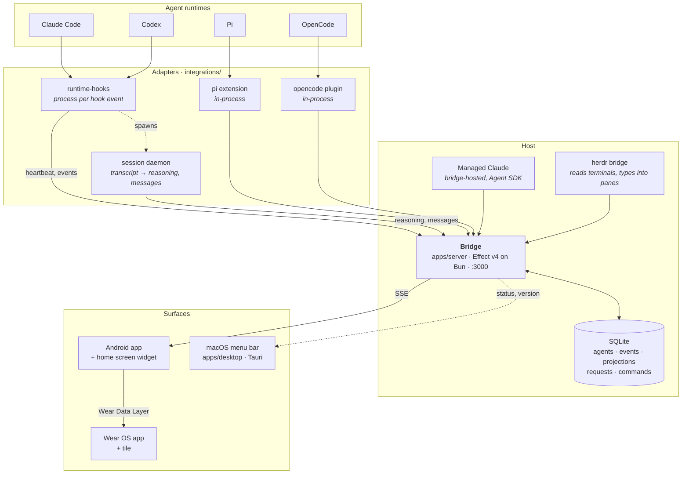
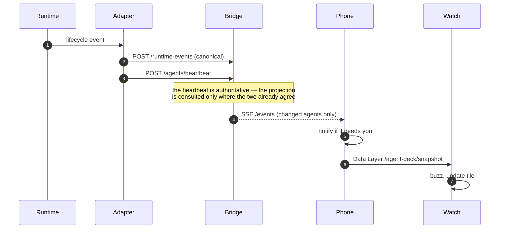
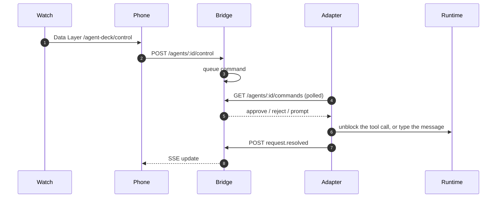

# Agent Deck

Watch and steer coding agents from a phone, a watch, or the menu bar.

A bridge on your machine collects what every agent session is doing — what it is
thinking, what it is waiting on, what it changed — and the surfaces read from it.
Approvals and questions can be answered from a wrist. Nothing is exposed
publicly; the bridge listens on localhost and is reached over a tailnet.

## The shape of it



Two relationships are left out of the diagram because drawing them backwards
against the flow made everything else harder to read: the menu bar app also
starts and stops the services through `launchctl`, and the watch keeps a direct
HTTP route to the bridge for when the phone is out of range.

Four ways an agent gets onto the deck, chosen by what the runtime allows:

| Runtime | How | Why |
| --- | --- | --- |
| Claude Code, Codex | A process per hook event | They offer stdin hooks and nothing else |
| Pi, OpenCode | An in-process extension | They load plugins, so there is no process to spawn |
| Managed Claude | The bridge runs the loop | No terminal involved; the bridge owns the session |

The split is not a preference. A hook runtime costs about 200 ms per event
because a runtime has to start; a plugin runtime costs nothing, and can hold a
tool call open while a phone decides whether to allow it.

## How a thought reaches a wrist



The bridge diffs per connection, so a client that attaches late does not depend
on another's position in the stream. The phone relays a trimmed snapshot to the
watch rather than having the watch hold its own connection — but the watch keeps
a direct route as a fallback, because the phone and the watch do not always
reach the bridge by the same address.

## How an answer gets back



A blocked tool call is a real process waiting. The adapter polls for the
decision, so an approval answered on a watch releases a `Bash` call in a
terminal seconds later.

## Repository

```
apps/
  server/       The bridge. Effect v4, Bun, SQLite.
  android/      shared/ · mobile/ (app + Glance widget) · wear/ (app + tile)
  ios/          SwiftUI phone app: deck, session, approvals
  desktop/      Tauri menu bar app: service control, harness setup, updates
integrations/
  runtime-hooks/  Claude Code and Codex, plus the per-session daemon
  pi/             Pi extension
  opencode/       OpenCode plugin
  herdr/          Terminal state the hooks cannot see; message delivery
packages/
  agent-adapter/  Bridge client, canonical events, projector, approval policy
scripts/
  agent-deck-service.ts   launchd jobs, generated from one definition
  release-desktop.ts      Build, sign, notarize, emit the update manifest
```

## Running it

```bash
bun install
bun run scripts/agent-deck-service.ts install   # bridge + herdr as launchd jobs
bun run scripts/agent-deck-service.ts status
```

Then connect the runtimes you use:

```bash
bun run integrations/runtime-hooks/install.ts claude   # or codex
bun run integrations/opencode/install.ts
bun run integrations/pi/install.ts
```

The desktop app does the same from a UI, and shows which harnesses are wired in.

### Services

Both background jobs are generated from one definition in
`scripts/agent-deck-service.ts`. That is deliberate: a plist written by hand and
never revisited once pointed at an entry point that had been deleted, and failed
3,691 times while the status check called it healthy. `status` now takes a pid as
proof of running and reports whether the entry point a plist names still exists.

```bash
bun run scripts/agent-deck-service.ts status        # both
bun run scripts/agent-deck-service.ts restart herdr # one
```

### Measuring it

```bash
bun run bench   # scratch bridge on :3177 — ingest, snapshot, SSE push, fan-out
```

The number that matters is SSE push: an event posted → the patch frame on the
wire. The fan-out row delivers one update to twenty subscribed devices and
clocks the slowest screen, because the deck is only as live as its worst one.
The bench found two shipped bugs on its first run — a lost-update race between
the revision bump and the state it announced, and Bun's 10-second default idle
timeout sitting under the stream's 15-second pings — which is the argument for
keeping it runnable in one command.

## Design notes

**The bridge is the only source of truth.** Every surface derives its state from
the same snapshot, and the shared reduction lives in one place per platform —
`packages/agent-adapter` for adapters, `apps/android/shared` for the phone and
watch. Two glanceable surfaces disagreeing about how many sessions want you is
worse than either being wrong, because neither can be trusted afterwards.

**Widgets never fetch.** A widget composes on the system's schedule, usually with
the app dead and sometimes with no route to the bridge. Both the home screen
widget and the watch tile draw from a summary on disk, written by whatever
already receives snapshots.

**Attention is decided once.** `AttentionPolicy` in `apps/android/shared` decides
whether a session is asking for a person, and the phone and the watch both use
it. Anything that can be answered remotely carries a durable request with an
expiry, so a session cannot be left blocked on a device that went away.

**States are proven, not assumed.** A service that launchd holds is not a service
that is running; a port that answers is not necessarily this bridge. Both checks
look for a pid and an identifying response, because the cheaper versions of both
have already reported a healthy bridge that had never once started.

## Documentation

- [`CONTEXT.md`](CONTEXT.md) — the domain vocabulary: Agent, Project, Runtime
  Event, Runtime Projection, and what each one is allowed to mean.
- [`docs/`](docs) — protocol and adapter notes.
